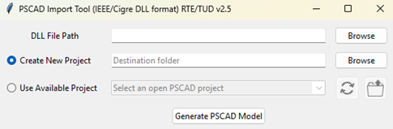
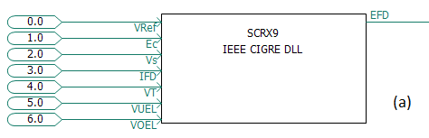
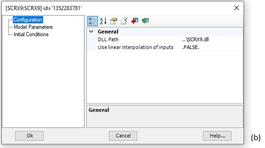
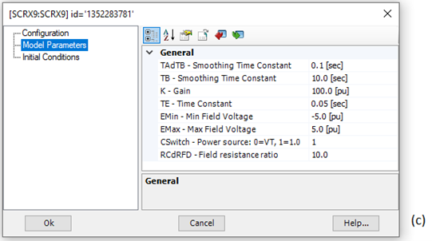
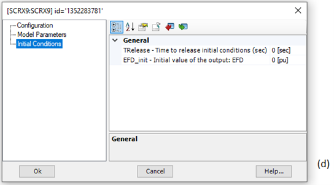

# PSCAD import tool of an IEEE/CIGRE DLL

This tool, created in Python and then compiled in .exe, is presented in the form of a simple graphical interface. Two versions of the executable are available (32 and 64-bit) depending on the type of architecture of the DLL to be imported. The import tool's GUI is shown in Figure 1.

*Figure 1: Graphical User Interface of PSCAD Import Tool (Developed by RTE & TU Delft)*

This tool works only with PSCAD version 5 and Intel Fortran compilers. This may not work for old versions (2012 or less) of Intel Fortran compilers.

The user may start by selecting an IEEE/CIGRE DLL using the first browse button to convert it into a PSCAD DLL-based component. The integration process consists of:

- Creating and placing the component on the main canvas of a PSCAD project.
- Generating a Fortran interface file that facilitates communication between the component and the DLL.
- Adding the interface link to the project’s resources.
- Copying both the Fortran interface file and the DLL to the project’s folder.

The user has two options for integrating the component.

1. Create New Project: a new PSCAD project will be created inside the “Destination folder” specified using the second browse button. After clicking the “Generate PSCAD Model”, the component will be created inside the new project.
2. Use Available Project: The import tool detects a running PSCAD instance and lists all the loaded projects. After selecting one of the projects and clicking the “Generate PSCAD Model”, the component will be created inside the selected project.

The import tool provides two more buttons on its GUI.

- Refresh projects: For refreshing the list of available projects in case new projects are loaded by the user
- Open project’s location: To navigate the user to the selected project’s location, where the DLL and Fortran interface link are present.

As an example, Figure 2 (a) shows the representation of the SCRX9 component generated by the IEEE/CIGRE DLL import tool in PSCAD software environment. By double-clicking on the component block, various settings can be edited as shown in Figure (b)-(d).

*Figure 2 a: Example of an IEEE/CIGRE DLL component in PSCAD. Imported component*

*Figure 2 b: Example of an IEEE/CIGRE DLL component in PSCAD. Configuration tab*

*Figure 2 c: Example of an IEEE/CIGRE DLL component in PSCAD. Model Parameters tab*

*Figure 2 d: Example of an IEEE/CIGRE DLL component in PSCAD. Initial Conditions tab*

More explanations for each tab can be found as follows:

- Configuration tab

In the first “Configuration” tab, the path to the DLL is specified. While the path is set automatically, the user can modify it by specifying a relative or absolute path.

It is also possible to enable or disable the input linear interpolation feature, which is useful only if the time step of the DLL model is different from that of the PSCAD simulation.

- Model Parameters tab

The parameters of the model are shown and can be edited from this tab. Data labels can be used for parameters.

- Initial Conditions tab

There are additional options available via this tab. For example, TRelease allows an IEEE/CIGRE DLL model to be held at initial conditions until a certain release time. The other parameters are used to assign initial values to the outputs.

After setting the parameters, the PSCAD simulation can be run.

Notes:

- The snapshot feature will work properly if the IEEE/CIGRE DLL model has been designed to be compatible with it.
- The time-step of the PSCAD circuit can be set to a different value than the time-step of the DLL model. The user is free to decide whether or not to use the input interpolation in the Configuration tab.
- PSCAD multiple runs are allowed.
- Multiple instantiations of DLL models in PSCAD are supported by the solution.
- If the DLL is in 32-bit (respectively 64-bit), you must select a 32-bit (respectively 64-bit) Intel Fortran compiler in the PSCAD options.

## References

CIGRE TB958 JWG CIGRE B4.82/IEEE, «Guidelines for use of real-code in EMT models for HVDC, FACTs and inverter based generators in power systems analysis,» 2025.